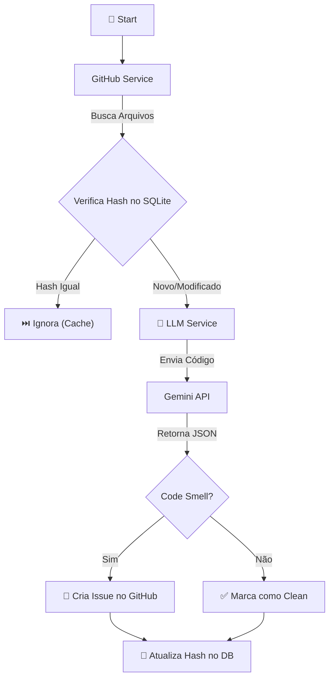

# 🕵️‍♂️ Code Smell Hunter (AI Powered)

Uma aplicação de **Engenharia de Software Assistida por IA** que automatiza o processo de Code Review.
O sistema monitora repositórios, identifica *Code Smells* utilizando LLMs (Google Gemini) e abre Issues 
automaticamente com sugestões de refatoração baseadas em princípios SOLID e Clean Code.

---

## 🧠 Arquitetura e Fluxo
O projeto segue uma **Arquitetura Modular** baseada em serviços desacoplados, facilitando testes e manutenção.



### Destaques Técnicos
* **Incrementalidade:** Utiliza um banco de dados local (SQLite) para armazenar o
  SHA (hash) do último commit analisado. A IA só é acionada para arquivos que foram alterados, economizando tokens e custo.
* **Design Patterns:**
  * **Repository Pattern:** Abstração do acesso a dados.
  * **Service Layer:** Separação clara entre lógica de negócio (LLM/GitHub) e orquestração.
  * **Adapter:** Wrapper em torno das APIs do GitHub e LangChain.
* **Repository Pattern:** Abstração do acesso a dados.
* **Service Layer:** Separação clara entre lógica de negócio (LLM/GitHub) e orquestração.
* **Adapter:** Wrapper em torno das APIs do GitHub e LangChain.
* **Language Agnostic:** Capaz de analisar Python, JavaScript, Java, C#, etc., identificando a extensão automaticamente.
* **Structured Output:** Utiliza `Pydantic` para garantir que a LLM retorne dados estruturados (JSON) e não texto livre.

---

## 🛠️ Estrutura do Projeto

```text
code_hunter/
├── app/
│   ├── models/
│   │   └──models.py            # Schemas (SQLAlchemy + Pydantic)
│   ├── services/
│   │   ├── github_service.py   # Integração com API do GitHub
│   │   └── llm_service.py      # Integração com LangChain/Gemini
│   ├── config.py               # Gestão centralizada de env vars
│   ├── database.py             # Conexão Singleton com SQLite
│   └── main.py                 # Orquestrador do Pipeline
├── .env                        # Credenciais (não versionado)
├── requirements.txt            # Dependências
└── README.md                   # Documentação

```

---

## 🚀 Como Executar

### 1. Pré-requisitos
* Python 3.9+
* Conta no Google AI Studio (para obter a API Key do Gemini)
* Conta no GitHub (para obter o Personal Access Token)

### 2. Instalação
Clone o repositório e instale as dependências:

```bash
git clone https://github.com/seu-usuario/code-smell-hunter.git
cd code-smell-hunter

# Cria ambiente virtual
python -m venv venv

# Ativa (Windows)
venv\Scripts\activate
# Ativa (Linux/Mac)
source venv/bin/activate

# Instala pacotes
pip install -r requirements.txt
```

### 3. Configuração
Crie um arquivo `.env` na raiz do projeto e preencha as variáveis:

```ini
# Chave da API do Google (Gemini)
GOOGLE_API_KEY="sua_chave_aqui"

# Token Pessoal do GitHub (precisa de permissão 'repo')
GITHUB_TOKEN="seu_token_github_aqui"

# Repositório alvo (formato usuario/repo)
REPO_NAME="usuario/repositorio-alvo"
```

### 4. Executando o Pipeline
Rode o script principal. Ele irá criar o banco de dados `code_hunter.db` na primeira execução.

```bash
python -m app.main
```

---

## 📊 Exemplo de Resultado

Quando a IA detecta um problema, uma Issue é criada automaticamente no GitHub com o seguinte formato:

> **Título:** `[Code Smell] Detectado em src/payment_controller.py`
> **Corpo da Issue:**
> * **Tipo:** God Class
> * **Severidade:** Alta
> * **Análise:** A classe possui 5 responsabilidades diferentes (validação, conexão com DB, envio de email, logs e regra de negócio), violando o Princípio da Responsabilidade Única (SRP).
> * **Sugestão de Correção:** (Bloco de código com a classe refatorada dividida em serviços menores).

---

## 🧪 Tecnologias Utilizadas

* **[LangChain](https://www.langchain.com/):** Framework para orquestração de LLMs.
* **[Google Gemini](https://deepmind.google/technologies/gemini/):** Modelo Generativo multimodal.
* **[PyGithub](https://github.com/PyGithub/PyGithub):** Cliente Python para API do GitHub.
* **[SQLAlchemy](https://www.sqlalchemy.org/):** ORM para persistência de estado.
* **[Pydantic](https://www.google.com/search?q=https://docs.pydantic.dev/):** Validação de dados e parsing de saída da IA.

---

## 📝 Licença
Este projeto está sob a licença MIT. Sinta-se à vontade para usar para fins educacionais.